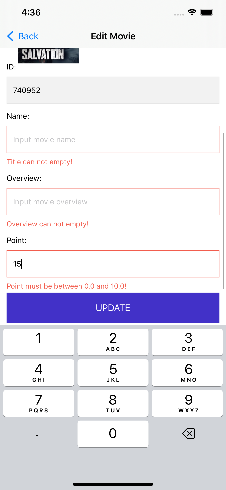

# Clean Swift Architecture iOS App

Liked some of my work? Buy me a coffee (or more likely a beer)

## Features :heart:
- Architecture: <a href="https://clean-swift.com/">Clean Swift Architecture (VIP)</a>
- API: <a href="https://developers.themoviedb.org/3/getting-started/introduction">TMDB-Movies APIs</a>
- Dependency Injection

## Structure Application

## Application
| Upcoming Movies | Edit Movie  | Update Movie  |
| ------------ | ------------ | ------------ |
|  |  |  |

## Clean Swift Architecture (VIP) :heart:
The Clean Swift Architecture (VIP) was created by Raymond Law, a software engineer and instructor based in San Francisco, California. Raymond developed the Clean Swift Architecture as a variation of the Clean Architecture, which was originally proposed by Robert C. Martin (also known as "Uncle Bob").

  

View
- Defines a scene and contains a view or views
- Keeps instances of the interactor and router.
- Passes the actions from views to the interactor (output) and takes the presenter actions as input

Interactor
- Contains a Scene’s business logic.
- Keeps a reference to the presenter.
- Runs actions on workers based on input (from the View Controller), triggers and passes the output to the presenter.
- The interactor should never import the UIKit.

Presenter
- Keeps a weak reference to the view controller that is an output of the presenter.
- After the interactor produces some results, it passes the response to the presenter. Next, the presenter marshals the response into view models suitable for display and then passes the view models back to the view controller for a display to the user.

Worker
- An abstraction that handles different under-the-hood operations like fetch the user from Core Data, download the profile photo, allows users to like and follow, etc.
- Should follow the Single Responsibility principle (an interactor may contain many workers with different responsibilities).

Router
- Extracts this navigation logic out of the view controller.
- Keeps a weak reference to the source (View Controller)

Configurator
- Takes the responsibility of configuring the VIP cycle by encapsulating the creation of all instances and assigning them where needed.

Model
- Decoupled data abstractions.

## Requirements

- iOS 12.0+
- Xcode 11+

## Installation

To install the app, clone the repository and open the `TMDB-Movies-VIP.xcworkspace` file in Xcode.

## Usage

TODO: Describe how to use the app.

## Contribution

<a href="https://www.linkedin.com/in/kien-ht/">Hoàng Trọng Kiên (Bradley)</a>

## Reference

- https://youtu.be/Szlgqnk6gHg 
- https://medium.com/@nirajpaul.ios/vip-architecture-pattern-vip-viper-302d7d1069df 
- https://www.netguru.com/blog/clean-swift-ios-architecture-pattern
